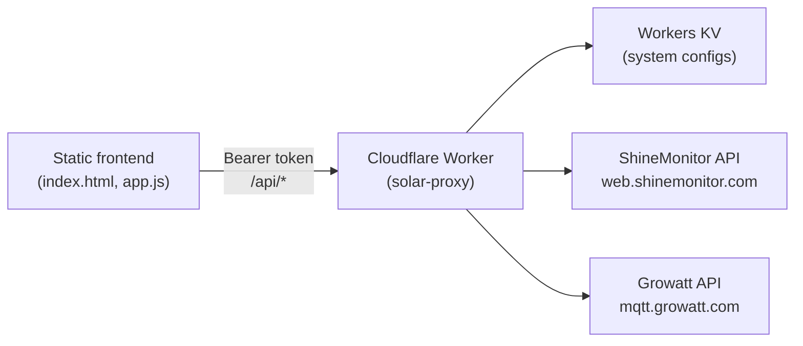

# Solar Dashboard

A lightweight, real-time solar monitoring dashboard for off-grid and hybrid inverter systems. The frontend is a static single-page app; a Cloudflare Worker proxy handles authentication, stores system credentials, and normalizes data from vendor APIs (ShineMonitor, Growatt) into one common format.

## Architecture



| Layer | Role |
|-------|------|
| **Frontend** | Dashboard UI — cards, energy-flow, and chart views; 60 s polling; multi-system tabs. Stores proxy URL + access token in `localStorage`. |
| **Worker** | Token-gated REST API. Discovers plants/devices on setup, caches vendor sessions in memory, returns normalized JSON. History routes proxy vendor APIs on demand. |
| **KV** | System configs (`system:<id>`), credentials index (`_index`), and optional alert state (`alert-state:<uuid>`). No historical readings are stored. |
| **Vendor APIs** | ShineMonitor (signed GET) and Growatt (cookie session POST). Neither is callable directly from the browser due to CORS and auth complexity. |

## Quick start (local dev)

Run the full dashboard locally with **Docker Compose** — mock Worker API plus static frontend, no Cloudflare account or inverter credentials required.

```bash
# From the repository root
npm run dev
# equivalent: docker compose up --build
```

| Service | URL |
|---------|-----|
| Dashboard | http://localhost:8080 |
| Mock Worker API | http://localhost:8787 |

On the setup screen, enter:

- **Proxy URL:** `http://localhost:8787`
- **Access Token:** `e2e-test-token`

The mock Worker serves normalized JSON from `e2e/fixtures/` (two sample systems, intraday history, 7-day summary). Use this stack for UI work, E2E debugging, or offline development.

**Real Miniflare Worker** (local KV, no mock fixtures — add systems with real inverter credentials):

```bash
npm run dev:worker
# Proxy URL: http://localhost:8787 — leave token empty (open dev mode)
```

**Without Docker** (Node.js 20+):

```bash
cd worker && npm ci && cd ../e2e && npm ci && cd ..
npm run dev:local          # mock Worker + static server
npm run dev:local:worker   # wrangler dev + static server
```

Stop Docker services with `npm run dev:down`.

## Prerequisites

- [Cloudflare account](https://dash.cloudflare.com/sign-up) (Workers + KV)
- [Node.js](https://nodejs.org/) 18+ (for Wrangler)
- [Wrangler CLI](https://developers.cloudflare.com/workers/wrangler/install-and-update/) — installed via the worker package (see below)

## Deploy the Worker

> **First-time production deploy:** follow the step-by-step runbook at **[worker/DEPLOY.md](./worker/DEPLOY.md)** — KV namespace binding, all three secrets (`API_TOKEN`, `CREDENTIALS_KEY`, `ALLOWED_ORIGINS`), optional alert webhooks, cron verification, production checklist, and tag-based CI releases.

1. **Install dependencies**

   ```bash
   cd worker
   npm install
   ```

2. **Create a KV namespace** (first-time only)

   ```bash
   npx wrangler kv namespace create SYSTEMS
   ```

   Copy the returned `id` into `worker/wrangler.toml`:

   ```toml
   [[kv_namespaces]]
   binding = "SYSTEMS"
   id = "<your-namespace-id>"
   ```

3. **Set the shared access token** (required for production)

   ```bash
   npx wrangler secret put API_TOKEN
   ```

   Choose a long random string. The frontend sends this as `Authorization: Bearer <token>`. **Never commit the token to git.**

4. **Deploy**

   ```bash
   npx wrangler deploy
   ```

   Note the Worker URL (e.g. `https://solar-proxy.<account>.workers.dev`).

5. **Local development** (optional)

   ```bash
   npm run dev
   ```

   If `API_TOKEN` is not set, the Worker runs in open mode (no auth) — useful for local testing only.

### Staging environment

Staging is a separate Cloudflare Worker (`solar-proxy-staging`) with its **own KV namespace** — system configs, credentials, and alert state never share storage with production.

| | Production | Staging |
|---|------------|---------|
| Worker name | `solar-proxy` | `solar-proxy-staging` |
| Deploy command | `npx wrangler deploy` | `npx wrangler deploy --env staging` |
| npm script | `npm run deploy` | `npm run deploy:staging` |
| URL | `https://solar-proxy.<account>.workers.dev` | `https://solar-proxy-staging.<account>.workers.dev` |
| KV namespace | Top-level `[[kv_namespaces]]` in `wrangler.toml` | `[[env.staging.kv_namespaces]]` (different `id`) |
| CI trigger | Push a version tag (`v*`) | Manual (`npm run deploy:staging`) |
| Typical use | Live dashboard | Pre-release testing, adapter changes |

**One-time staging setup**

1. Create an isolated KV namespace and copy its id into `worker/wrangler.toml` under `[[env.staging.kv_namespaces]]` (if not already set):

   ```bash
   cd worker
   npx wrangler kv namespace create SYSTEMS --env staging
   ```

   The command prints a namespace `id`. Ensure it is committed in `wrangler.toml` and **differs** from the production namespace id.

2. Set staging-only secrets (use different values from production where appropriate):

   ```bash
   npx wrangler secret put API_TOKEN --env staging
   npx wrangler secret put CREDENTIALS_KEY --env staging   # optional but recommended
   npx wrangler secret put ALLOWED_ORIGINS --env staging   # e.g. Pages preview URL, localhost
   ```

   Secrets are scoped per environment — `wrangler secret put API_TOKEN` does **not** update staging.

3. Deploy staging:

   ```bash
   npx wrangler deploy --env staging
   ```

4. Point a test frontend at the staging Worker URL and staging `API_TOKEN` in the setup screen (or `?proxy=...&token=...`).

**Local dev against staging config** (optional):

```bash
npx wrangler dev --env staging
```

Production and staging deploys are **tag-only** in CI (see [CI/CD](#cicd)). Deploy staging manually when needed:

### Historical data (vendor APIs)

Charts and multi-day summaries fetch **live from inverter cloud APIs** on each request. The Worker does not archive historical readings in KV — vendor portals are the source of truth.

| Route | Behavior |
|-------|----------|
| `GET /api/systems/:id/history?date=` | Intraday power series (solar, load, battery). Dispatches to the service adapter's `fetchHistory()` for the requested date (defaults to today in plant-local time). |
| `GET /api/systems/:id/history/summary?days=7` | Daily energy totals and SOC extrema for bar charts. Dispatches to `fetchHistorySummary()` (default 7 days, max 90). |

**Vendor limitations** — If the inverter account is offline, credentials expired, or the vendor API returns no rows for a date, the chart view shows an empty or partial series. There is no Worker-side backfill; missing days are omitted from summaries until the vendor provides data.

**ShineMonitor yesterday fallback** — For realtime `fetchData` and intraday `fetchHistory` when no explicit `date` is given, if today's device data is not yet available the adapter retries with yesterday's date (plant timezone). This covers the common gap before the vendor publishes the current day's series.

Multi-day summaries may require one vendor round-trip per day (e.g. ShineMonitor aggregates from daily `fetchHistory` calls). Use a reasonable `days` value to avoid rate limits.

### Run tests locally

**Worker** (Vitest + Miniflare):

```bash
cd worker
npm install
npm test
```

Tests use [Vitest](https://vitest.dev/) with `@cloudflare/vitest-pool-workers`.

**Frontend helpers** (Vitest + happy-dom, pure functions in `frontend/lib.js`):

```bash
cd frontend
npm install
npm test
```

## CI/CD

GitHub Actions runs on every push to `main`, on version tags, and on pull requests (`.github/workflows/ci.yml`):

1. **Test** — worker unit tests, frontend unit tests, and Playwright E2E (runs on PRs and all pushes).
2. **Deploy (production)** — only when you push a semver tag `vMAJOR.MINOR.PATCH` (e.g. `v1.2.0`). After tests pass, CI deploys **both** the static frontend to [Cloudflare Pages](https://developers.cloudflare.com/pages/) (**https://solar-dashboard.pages.dev**) and the production Worker (`wrangler deploy`).

Merges to `main` run tests only — nothing goes live until you cut a release tag.

### Release a version

```bash
git checkout main
git pull

# Tag the commit you want live (usually tip of main)
git tag v1.2.0
git push origin v1.2.0
```

CI validates the tag format, runs the full test suite, then deploys frontend + Worker from that tag's snapshot. Each new tag you push becomes the live site/API.

### Required GitHub secrets

| Secret | Purpose |
|--------|---------|
| `CLOUDFLARE_API_TOKEN` | Authenticates Wrangler for Worker and Pages deploy on release tags. Create a [Cloudflare API token](https://developers.cloudflare.com/fundamentals/api/get-started/create-token/) with **Edit Cloudflare Workers** (and KV read/write for production and staging `SYSTEMS` namespaces) plus **Cloudflare Pages — Edit**. |
| `CLOUDFLARE_ACCOUNT_ID` | Your Cloudflare account ID (Dashboard → Workers & Pages → right sidebar). Required for Pages deploy. |

Add secrets under **Repository → Settings → Secrets and variables → Actions → New repository secret**.

Runtime secrets (`API_TOKEN`, `CREDENTIALS_KEY`, `ALLOWED_ORIGINS`) are **not** set by CI — configure those once per environment with `wrangler secret put` (add `--env staging` for staging). See [Staging environment](#staging-environment).

## Observability

The Worker emits **structured JSON logs** for adapter failures (502 responses), alert webhook errors, and scheduled alert fetch failures. Each log line includes `level`, `event`, `timestamp`, and context such as `systemId`, `service`, and `route`. Credentials, bearer tokens, and webhook URLs are redacted before output — never logged in plain text.

### Viewing logs

| Method | Use case |
|--------|----------|
| **`wrangler tail`** | Real-time stream during development or incident response |
| **Workers Logs** (dashboard) | Search and filter production log history |
| **Logpush** | Ship logs to S3, Datadog, or other sinks for long-term retention |

Example tail output (one JSON object per line):

```json
{"level":"error","event":"adapter_fetch_failed","timestamp":"2026-07-06T12:00:00.000Z","systemId":"abc-123","service":"growatt","route":"GET /api/systems/:id/data","message":"vendor timeout","error":{"name":"Error","message":"vendor timeout"}}
```

### Optional: Workers Analytics Engine

For queryable error metrics (counts by `systemId` / `service`), bind a Workers Analytics Engine dataset:

1. Create a dataset in the Cloudflare dashboard (**Workers & Pages → Analytics Engine → Create dataset**).
2. Add the binding to `worker/wrangler.toml`:

   ```toml
   [[analytics_engine_datasets]]
   binding = "ANALYTICS"
   dataset = "solar_proxy_errors"
   ```

3. Redeploy. Error events are written automatically via `writeDataPoint` when the binding is present.

### Sentry and third-party APM

The Worker does **not** bundle a Sentry SDK (keeps the zero-dependency footprint). Options for production error tracking:

- **Logpush → Sentry** — forward Workers JSON logs and parse `event` / `systemId` fields.
- **Cloudflare Workers integration** — connect Sentry in the Cloudflare dashboard for unhandled exceptions (complements structured logs for handled 502 paths).
- **Analytics Engine + Grafana** — chart error rates from the optional dataset above.

No additional secrets are required for console-only logging. Analytics Engine uses the dashboard binding; external APM setup is account-specific.

## Host the Frontend

The frontend is static — no build step. Serve `index.html`, `app.js`, `style.css`, `manifest.json`, `sw.js`, and `icons/` from the repository root.

### Cloudflare Pages (recommended)

**Production URL:** https://solar-dashboard.pages.dev

Production deploys happen when you push a release tag (see [CI/CD](#cicd) above). The workflow runs `scripts/stage-frontend.sh` to copy only static assets into `dist/`, then `wrangler pages deploy`.

**One-time setup** (if not already configured):

1. Add GitHub secrets `CLOUDFLARE_API_TOKEN` and `CLOUDFLARE_ACCOUNT_ID` (see table above).
2. Push a release tag (e.g. `v1.0.0`) — the first deploy creates the `solar-dashboard` Pages project if it does not exist.
3. Configure Worker CORS (below) so the browser can call the proxy from the Pages origin.

**Manual deploy** (optional):

```bash
bash scripts/stage-frontend.sh dist
npx wrangler pages deploy dist --project-name=solar-dashboard
```

**Alternative — connect Git in the Cloudflare dashboard:** Workers & Pages → Create → Pages → Connect to Git → select this repo. Build command: *(none)* · Build output directory: `/` · Root directory: `/`. Disable the dashboard auto-deploy if you rely on the GitHub Action above to avoid duplicate deployments.

### CORS (Worker ↔ frontend)

Browsers block cross-origin API calls unless the Worker returns matching `Access-Control-Allow-Origin` headers. Set the frontend origin(s) on the Worker:

```bash
cd worker
npx wrangler secret put ALLOWED_ORIGINS
```

Enter a comma-separated list, for example:

```
https://solar-dashboard.pages.dev,https://your-custom-domain.com
```

Include every origin users open in the browser (production Pages URL, custom domain, local dev). When `ALLOWED_ORIGINS` is unset, the Worker reflects any request origin (dev mode only — do not use in production).

After updating `ALLOWED_ORIGINS`, no Worker redeploy is required; secrets take effect immediately.

The setup screen default **Proxy URL** (`https://solar-proxy.gaspar-solar.workers.dev`) is independent of where the frontend is hosted — it always points at the Cloudflare Worker API.

### GitHub Pages

1. Push the repo to GitHub.
2. **Settings → Pages → Build and deployment**: source = `Deploy from a branch`, branch = `main` (or your default), folder = `/ (root)`.
3. Add your GitHub Pages URL to `ALLOWED_ORIGINS` on the Worker (same command as above).
4. Open the published URL and complete [first-time setup](#first-time-setup).

### Local

From the repository root:

```bash
python3 -m http.server 8080
# or: npx serve .
```

Open `http://localhost:8080`. Add `http://localhost:8080` to `ALLOWED_ORIGINS` if the Worker secret is set, or leave `ALLOWED_ORIGINS` unset for local dev.

## First-Time Setup

1. **Deploy the Worker** and set `API_TOKEN` (above).
2. **Open the frontend** at https://solar-dashboard.pages.dev (or GitHub Pages / local).
3. On the setup screen, enter:
   - **Proxy URL** — your Worker URL, no trailing slash (e.g. `https://solar-proxy.example.workers.dev`)
   - **Access Token** — the same value you set with `wrangler secret put API_TOKEN`
4. Click **Connect**. The app validates the token against `GET /api/systems`.
5. **Add a system** — choose service (ShineMonitor or Growatt), display name (optional), and inverter portal username/password. The Worker runs discovery (plant, device, nominal power) and stores credentials in KV.
6. The dashboard polls `GET /api/systems/:id/data` every 60 seconds.

**Bookmark auto-connect:** append query parameters to skip the setup form:

```
https://your-frontend.example/?proxy=https://solar-proxy.example.workers.dev&token=YOUR_TOKEN
```

Use only on trusted devices — the token appears in the URL and browser history.

## Worker API

| Method | Path | Description |
|--------|------|-------------|
| `GET` | `/api/health` | Health check — returns `{ ok, version }` (no auth required) |
| `GET` | `/api/services` | Supported inverter types |
| `GET` | `/api/systems` | List systems (no credentials) |
| `POST` | `/api/systems` | Add system (`service`, `user`, `password`, optional `name`) |
| `PUT` | `/api/systems/:id/credentials` | Update portal username/password; re-runs discovery and updates KV |
| `DELETE` | `/api/systems/:id` | Remove a system |
| `GET` | `/api/systems/:id/data` | Normalized real-time data for one system |
| `GET` | `/api/systems/:id/ha` | Flat JSON for Home Assistant REST sensors (same data as `/data`) |
| `GET` | `/api/systems/all/data` | Data for all systems |
| `GET` | `/api/systems/:id/history?date=` | Intraday power series (vendor fetch on demand) |
| `GET` | `/api/systems/:id/history/summary?days=7` | Daily energy totals for bar chart (vendor fetch on demand) |

All routes require `Authorization: Bearer <API_TOKEN>` when the secret is configured.

**Rate limits:** Real-time data routes (`GET /api/systems/:id/data`, `GET /api/systems/:id/ha`, and `GET /api/systems/all/data`) are limited to **60 requests per minute per bearer token** (in-memory per Worker isolate). Exceeding the limit returns **429 Too Many Requests** with a `Retry-After` header (seconds until the window resets). Normal dashboard polling at 60 s intervals is well below this limit. Rate limiting is disabled when `API_TOKEN` is unset (dev open mode).

## Home Assistant integration

Expose inverter metrics in [Home Assistant](https://www.home-assistant.io/) via the **`GET /api/systems/:id/ha`** endpoint. It returns the same realtime snapshot as `/data`, flattened into a **stable snake_case schema** (`schema_version: 1`) so REST sensors can use simple `value_template` paths without nested JSON.

### Prerequisites

1. Deploy the Worker and add at least one system (dashboard setup or `POST /api/systems`).
2. Note the **system UUID** from `GET /api/systems` (e.g. `a1b2c3d4-...`).
3. Use the same **Worker URL** and **`API_TOKEN`** as the dashboard.

### Response schema (v1)

```json
{
  "schema_version": 1,
  "system_id": "uuid",
  "name": "Cabin Solar",
  "service": "growatt",
  "timestamp": "2026-07-03 14:32:00",
  "battery_soc": 72,
  "battery_voltage": 48.2,
  "battery_current": -15,
  "battery_power": -723,
  "solar_power": 1200,
  "solar_voltage": 95,
  "load_power": 850,
  "load_percent": 24,
  "grid_power": 0,
  "grid_voltage": 0,
  "grid_active": false,
  "inverter_rated_power": 3500,
  "inverter_nominal_pv": 5000,
  "status": "PV Charging",
  "energy_today_kwh": 12.4
}
```

| Field | Unit / type | Notes |
|-------|-------------|-------|
| `battery_current` | A | Negative = charging, positive = discharging |
| `battery_power` | W | Same sign convention as current |
| `grid_active` | boolean | Generator/grid input detected |
| `energy_today_kwh` | kWh | Today's PV production when available |

Breaking changes to this shape will increment `schema_version`. Poll at **60 s or slower** to stay within rate limits and avoid stressing vendor APIs.

### Example: REST sensors (`configuration.yaml`)

Store secrets in [secrets.yaml](https://www.home-assistant.io/docs/configuration/secrets/):

```yaml
solar_ha_url: https://solar-proxy.example.workers.dev/api/systems/your-system-uuid/ha
solar_api_token: your-long-random-token
```

Add sensors (one per metric, or pick the fields you need):

```yaml
rest:
  - resource: !secret solar_ha_url
    scan_interval: 60
    headers:
      Authorization: "Bearer !secret solar_api_token"
    sensor:
      - name: Solar Battery SOC
        unique_id: solar_battery_soc
        value_template: "{{ value_json.battery_soc }}"
        unit_of_measurement: "%"
        device_class: battery
        json_attributes_path: "$"
        json_attributes:
          - battery_voltage
          - battery_power
          - solar_power
          - load_power
          - status

      - name: Solar Production
        unique_id: solar_production_w
        value_template: "{{ value_json.solar_power }}"
        unit_of_measurement: W
        device_class: power
        state_class: measurement

      - name: Solar Load
        unique_id: solar_load_w
        value_template: "{{ value_json.load_power }}"
        unit_of_measurement: W
        device_class: power
        state_class: measurement

      - name: Solar Generator Active
        unique_id: solar_generator_active
        value_template: "{{ value_json.grid_active }}"
        device_class: power
```

### Example: REST command-line test

```bash
curl -sS -H "Authorization: Bearer $API_TOKEN" \
  "https://solar-proxy.example.workers.dev/api/systems/$SYSTEM_ID/ha" | jq .
```

### Alternatives

| Approach | When to use |
|----------|-------------|
| **`/ha` endpoint** (recommended) | Stable flat schema; easiest REST sensor templates |
| **`/data` endpoint** | Custom automations that already consume nested JSON (`value_json.battery.soc`) |
| **Alert webhooks** | Push notifications on low SOC or generator start (Worker cron + `PUT /api/systems/:id/alerts`) — not a continuous sensor feed |
| **MQTT** | Out of scope for the Worker; use an external bridge (e.g. Node-RED or a small script polling `/ha` and publishing to your broker) |

Home Assistant runs server-side and is not subject to browser CORS. You do not need to add the HA host to `ALLOWED_ORIGINS` unless you also open the Worker from a browser on that host.

## Normalized Data Contract

Both adapters return the same shape from `GET /api/systems/:id/data`:

```json
{
  "systemId": "uuid",
  "name": "Plant display name",
  "service": "shinemonitor | growatt",
  "timestamp": "2026-04-04 18:19:48",
  "battery": {
    "voltage": 51.6,
    "soc": 72,
    "current": -62,
    "power": -3200
  },
  "solar": {
    "power": 110,
    "voltage": 245.8
  },
  "load": {
    "power": 283,
    "percent": 5
  },
  "grid": {
    "power": 0,
    "voltage": 0,
    "active": false
  },
  "inverter": {
    "ratedPower": 5200,
    "nominalPV": 5000
  },
  "status": "Grid-Tie",
  "energyToday": 1.9
}
```

| Field | Meaning |
|-------|---------|
| `battery.current` | Amps; negative = charging, positive = discharging |
| `battery.soc` | State of charge 0–100 (Growatt: from API; ShineMonitor: API `BATTERY_SOC` when valid, else voltage estimate) |
| `grid.active` | Generator/grid source considered active (voltage + power thresholds) |
| `inverter.ratedPower` | AC nameplate (W) — used for load % |
| `inverter.nominalPV` | PV array nameplate (W) — used for solar % |
| `energyToday` | Today's PV energy (kWh), when available |

## Security

- **`API_TOKEN`** — Set only via `wrangler secret put`. Do not commit tokens, inverter passwords, or `.env` files. The repo `.gitignore` excludes `.env`.
- **Inverter credentials** — Stored encrypted in Workers KV when `CREDENTIALS_KEY` is set (`wrangler secret put CREDENTIALS_KEY`). Restrict Cloudflare account access; treat KV as sensitive.
- **Frontend token storage** — The access token is kept in `localStorage` (and optionally URL params for bookmarks). Anyone with the token can call your Worker API. Rotate the token if it is exposed.
- **HTTPS only** — Use HTTPS for both the Worker and frontend in production.
- **Dev mode** — If `API_TOKEN` is unset, the Worker accepts unauthenticated requests. Never deploy to production without the secret.
- **Rate limiting** — Data routes (`/data`, `/ha`, `/all/data`) are capped at 60 requests/minute per bearer token (per isolate). Returns 429 with `Retry-After` when exceeded. Protects upstream inverter APIs from burst polling or scripted clients.

## Documentation

| Document | Description |
|----------|-------------|
| [worker/DEPLOY.md](./worker/DEPLOY.md) | Worker deployment runbook (KV, secrets, cron, CI) |
| [PLAN.md](./PLAN.md) | Project plan and roadmap |
| [discovery/ADAPTER_GUIDE.md](./discovery/ADAPTER_GUIDE.md) | **Adding a new inverter brand** — adapter interface, tests, registration |
| [discovery/README.md](./discovery/README.md) | Discovery folder index (ShineMonitor quick start) |
| [discovery/API.md](./discovery/API.md) | ShineMonitor API reference |
| [discovery/growatt/README.md](./discovery/growatt/README.md) | Growatt API discovery notes |
| [discovery/growatt/API.md](./discovery/growatt/API.md) | Growatt API reference |
| [RELEASE_NOTES.md](./RELEASE_NOTES.md) | Version history |

## Repository Layout

```
├── index.html, app.js, style.css   # Static frontend
├── docker-compose.yml              # Local dev stack (mock or Miniflare Worker)
├── Dockerfile                      # Dev image for compose services
├── package.json                    # npm run dev — one-command local stack
├── scripts/
│   ├── dev-local.js                # Non-Docker local dev (mock or wrangler)
│   ├── docker-api-entry.sh         # Compose: mock Worker or wrangler dev
│   └── docker-frontend-entry.sh    # Compose: static file server
├── worker/
│   ├── src/index.js                # Worker entry + REST routes + scheduled alerts
│   ├── src/logger.js               # Structured JSON logging + optional Analytics Engine
│   ├── src/history.js              # Shared adapter helpers (daily summary math, SOC merge)
│   ├── src/services/               # ShineMonitor & Growatt adapters
│   └── wrangler.toml               # Worker + KV binding; [env.staging] for staging
└── discovery/                      # Reverse-engineered vendor API docs
```

## License

Personal automation use. Respect ShineMonitor / Growatt terms of service; vendor APIs are undocumented and may change without notice.
