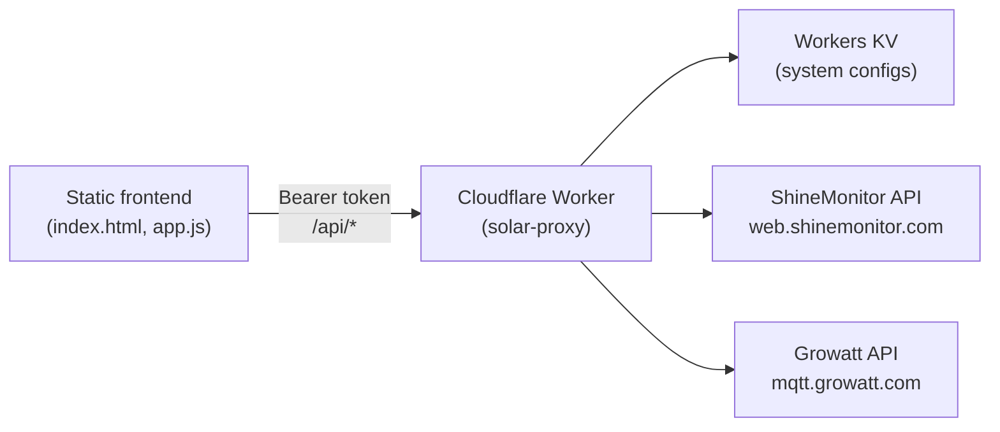

# Solar Dashboard

A lightweight, real-time solar monitoring dashboard for off-grid and hybrid inverter systems. The frontend is a static single-page app; a Cloudflare Worker proxy handles authentication, stores system credentials, and normalizes data from vendor APIs (ShineMonitor, Growatt) into one common format.

## Architecture



| Layer | Role |
|-------|------|
| **Frontend** | Dashboard UI — cards, energy-flow, and chart views; 60 s polling; multi-system tabs. Stores proxy URL + access token in `localStorage`. |
| **Worker** | Token-gated REST API. Discovers plants/devices on setup, caches vendor sessions, returns normalized JSON. Cron job snapshots realtime data into KV history keys. |
| **KV** | System configs (`system:<id>`), credentials index (`_index`), and **history snapshots** (`history:day:*`, `history:index:*`). |
| **Vendor APIs** | ShineMonitor (signed GET) and Growatt (cookie session POST). Neither is callable directly from the browser due to CORS and auth complexity. |

## Prerequisites

- [Cloudflare account](https://dash.cloudflare.com/sign-up) (Workers + KV)
- [Node.js](https://nodejs.org/) 18+ (for Wrangler)
- [Wrangler CLI](https://developers.cloudflare.com/workers/wrangler/install-and-update/) — installed via the worker package (see below)

## Deploy the Worker

1. **Install dependencies**

   ```bash
   cd worker
   npm install
   ```

2. **Create a KV namespace** (first-time only)

   ```bash
   npx wrangler kv namespace create SYSTEMS
   ```

   Copy the returned `id` into `worker/wrangler.toml`:

   ```toml
   [[kv_namespaces]]
   binding = "SYSTEMS"
   id = "<your-namespace-id>"
   ```

3. **Set the shared access token** (required for production)

   ```bash
   npx wrangler secret put API_TOKEN
   ```

   Choose a long random string. The frontend sends this as `Authorization: Bearer <token>`. **Never commit the token to git.**

4. **Deploy**

   ```bash
   npx wrangler deploy
   ```

   Note the Worker URL (e.g. `https://solar-proxy.<account>.workers.dev`).

5. **Local development** (optional)

   ```bash
   npm run dev
   ```

   If `API_TOKEN` is not set, the Worker runs in open mode (no auth) — useful for local testing only.

### Historical data (cron snapshots)

The Worker stores normalized realtime readings in KV on a schedule so charts and summaries survive vendor API gaps or account outages. Implementation lives in `worker/src/history.js`; the cron trigger is configured in `wrangler.toml`.

**Cron trigger** — enabled by default in `worker/wrangler.toml`:

```toml
[triggers]
crons = ["*/5 * * * *"]   # every 5 minutes (matches snapshot interval)
```

Each cron tick fetches realtime data for every configured system, appends a 5-minute bucket to that day's KV document, and prunes keys older than the retention window. **Charts backed by stored history only populate after the first cron cycles run** — allow up to one interval (5 minutes) after deploy before expecting intraday points from KV. Multi-day summaries need a full day of snapshots.

To change the schedule, edit `crons` in `wrangler.toml` and redeploy. Keep the interval aligned with `INTERVAL_MINUTES` (5) in `history.js`, or update both together.

**KV key layout** (same `SYSTEMS` namespace as system configs):

| Key | Value |
|-----|--------|
| `history:day:<systemId>:<YYYY-MM-DD>` | Daily snapshot JSON (see below) |
| `history:index:<systemId>` | JSON array of dates with stored data, newest first |

Example day document (no credentials — only normalized power/SOC fields):

```json
{
  "systemId": "550e8400-e29b-41d4-a716-446655440000",
  "date": "2026-07-03",
  "source": "snapshot",
  "intervalMinutes": 5,
  "points": [
    {
      "time": "14:30",
      "solar": 1200,
      "load": 850,
      "battery": -723,
      "soc": 72,
      "energyToday": 12.4
    }
  ],
  "dailySummary": {
    "solarKwh": 18.2,
    "loadKwh": 14.1,
    "peakSolarW": 3200,
    "minSoc": 45,
    "maxSoc": 98
  },
  "updatedAt": "2026-07-03T20:32:00.000Z"
}
```

Points are deduplicated by 5-minute time bucket (`14:32` → `14:30`). `dailySummary` is recomputed on each append from integrated power and SOC extrema.

**Retention** — default **90 days** per system (`DEFAULT_RETENTION_DAYS` in `history.js`). On each cron run, `pruneOld()` deletes `history:day:*` keys and index entries older than the cutoff. At ~15 KB/day, 90 days ≈ 1.4 MB per system — well within KV limits.

**Stored vs vendor history** — history API routes prefer KV snapshots when a day document exists, then fall back to vendor adapters (`fetchHistory`) for backfill or dates outside retention:

| Route | Behavior |
|-------|----------|
| `GET /api/systems/:id/history?date=` | Intraday power series. **Stored-first:** serve `history:day:*` points when present; otherwise call ShineMonitor/Growatt for that date. |
| `GET /api/systems/:id/history/summary?days=7` | Daily totals from stored `dailySummary` fields (solar/load kWh, peak solar, min/max SOC). Missing days omitted until snapshots exist. |

Vendor-only fetches remain available immediately after setup; stored series build up cron cycle by cron cycle. The chart view may show an empty or partial day until enough snapshots accumulate.

### Run tests locally

**Worker** (Vitest + Miniflare):

```bash
cd worker
npm install
npm test
```

**Frontend helpers** (Vitest + happy-dom, pure functions in `frontend/lib.js`):

```bash
cd frontend
npm install
npm test
```

## CI/CD

GitHub Actions runs on every push to `main` and on pull requests (`.github/workflows/ci.yml`):

1. **Test** — `npm ci` and `npm test` in `worker/`.
2. **Deploy** — when you push a version tag matching `v*` (e.g. `v1.2.0`), the workflow deploys the Worker with `wrangler deploy` after tests pass.

### Required GitHub secret

| Secret | Purpose |
|--------|---------|
| `CLOUDFLARE_API_TOKEN` | Authenticates `wrangler deploy` in CI. Create a [Cloudflare API token](https://developers.cloudflare.com/fundamentals/api/get-started/create-token/) with **Edit Cloudflare Workers** (and KV read/write for the `SYSTEMS` namespace). |

Add it under **Repository → Settings → Secrets and variables → Actions → New repository secret**.

Deploy is skipped on PRs and non-tag pushes. To release:

```bash
git tag v1.2.0
git push origin v1.2.0
```

Runtime secrets (`API_TOKEN`, `ALLOWED_ORIGINS`) are **not** set by CI — configure those once with `wrangler secret put` on your Cloudflare account.

## Host the Frontend

The frontend is static — no build step. Serve `index.html`, `app.js`, and `style.css` from the repository root.

### GitHub Pages

1. Push the repo to GitHub.
2. **Settings → Pages → Build and deployment**: source = `Deploy from a branch`, branch = `main` (or your default), folder = `/ (root)`.
3. Open the published URL and complete [first-time setup](#first-time-setup).

### Cloudflare Pages

1. **Workers & Pages → Create → Pages → Connect to Git** (or direct upload).
2. Build command: *(none)* · Output directory: `/` (repository root).
3. Deploy and open the Pages URL.

### Local

From the repository root:

```bash
python3 -m http.server 8080
# or: npx serve .
```

Open `http://localhost:8080`. The browser will call your deployed Worker URL (configure CORS is handled by the Worker).

## First-Time Setup

1. **Deploy the Worker** and set `API_TOKEN` (above).
2. **Open the frontend** (Pages, GitHub Pages, or local).
3. On the setup screen, enter:
   - **Proxy URL** — your Worker URL, no trailing slash (e.g. `https://solar-proxy.example.workers.dev`)
   - **Access Token** — the same value you set with `wrangler secret put API_TOKEN`
4. Click **Connect**. The app validates the token against `GET /api/systems`.
5. **Add a system** — choose service (ShineMonitor or Growatt), display name (optional), and inverter portal username/password. The Worker runs discovery (plant, device, nominal power) and stores credentials in KV.
6. The dashboard polls `GET /api/systems/:id/data` every 60 seconds.

**Bookmark auto-connect:** append query parameters to skip the setup form:

```
https://your-frontend.example/?proxy=https://solar-proxy.example.workers.dev&token=YOUR_TOKEN
```

Use only on trusted devices — the token appears in the URL and browser history.

## Worker API

| Method | Path | Description |
|--------|------|-------------|
| `GET` | `/api/services` | Supported inverter types |
| `GET` | `/api/systems` | List systems (no credentials) |
| `POST` | `/api/systems` | Add system (`service`, `user`, `password`, optional `name`) |
| `DELETE` | `/api/systems/:id` | Remove a system |
| `GET` | `/api/systems/:id/data` | Normalized real-time data for one system |
| `GET` | `/api/systems/all/data` | Data for all systems |
| `GET` | `/api/systems/:id/history?date=` | Intraday power series (stored KV first, vendor fallback) |
| `GET` | `/api/systems/:id/history/summary?days=7` | Daily energy/SOC summary from stored snapshots (default 7 days) |

All routes require `Authorization: Bearer <API_TOKEN>` when the secret is configured.

## Normalized Data Contract

Both adapters return the same shape from `GET /api/systems/:id/data`:

```json
{
  "systemId": "uuid",
  "name": "Plant display name",
  "service": "shinemonitor | growatt",
  "timestamp": "2026-04-04 18:19:48",
  "battery": {
    "voltage": 51.6,
    "soc": 72,
    "current": -62,
    "power": -3200
  },
  "solar": {
    "power": 110,
    "voltage": 245.8
  },
  "load": {
    "power": 283,
    "percent": 5
  },
  "grid": {
    "power": 0,
    "voltage": 0,
    "active": false
  },
  "inverter": {
    "ratedPower": 5200,
    "nominalPV": 5000
  },
  "status": "Grid-Tie",
  "energyToday": 1.9
}
```

| Field | Meaning |
|-------|---------|
| `battery.current` | Amps; negative = charging, positive = discharging |
| `battery.soc` | State of charge 0–100 (Growatt: from API; ShineMonitor: estimated from voltage) |
| `grid.active` | Generator/grid source considered active (voltage + power thresholds) |
| `inverter.ratedPower` | AC nameplate (W) — used for load % |
| `inverter.nominalPV` | PV array nameplate (W) — used for solar % |
| `energyToday` | Today's PV energy (kWh), when available |

## Security

- **`API_TOKEN`** — Set only via `wrangler secret put`. Do not commit tokens, inverter passwords, or `.env` files. The repo `.gitignore` excludes `.env`.
- **Inverter credentials** — Stored encrypted in Workers KV when `CREDENTIALS_KEY` is set (`wrangler secret put CREDENTIALS_KEY`). History snapshot keys contain only normalized power/SOC — never credentials. Restrict Cloudflare account access; treat KV as sensitive.
- **Frontend token storage** — The access token is kept in `localStorage` (and optionally URL params for bookmarks). Anyone with the token can call your Worker API. Rotate the token if it is exposed.
- **HTTPS only** — Use HTTPS for both the Worker and frontend in production.
- **Dev mode** — If `API_TOKEN` is unset, the Worker accepts unauthenticated requests. Never deploy to production without the secret.

## Documentation

| Document | Description |
|----------|-------------|
| [PLAN.md](./PLAN.md) | Project plan and roadmap |
| [discovery/README.md](./discovery/README.md) | ShineMonitor API discovery notes |
| [discovery/API.md](./discovery/API.md) | ShineMonitor API reference |
| [discovery/growatt/README.md](./discovery/growatt/README.md) | Growatt API discovery notes |
| [discovery/growatt/API.md](./discovery/growatt/API.md) | Growatt API reference |
| [RELEASE_NOTES.md](./RELEASE_NOTES.md) | Version history |

## Repository Layout

```
├── index.html, app.js, style.css   # Static frontend
├── worker/
│   ├── src/index.js                # Worker entry + REST routes + cron handler
│   ├── src/history.js              # KV snapshot storage, retention, daily summaries
│   ├── src/services/               # ShineMonitor & Growatt adapters
│   └── wrangler.toml               # Worker + KV binding + cron triggers
└── discovery/                      # Reverse-engineered vendor API docs
```

## License

Personal automation use. Respect ShineMonitor / Growatt terms of service; vendor APIs are undocumented and may change without notice.
