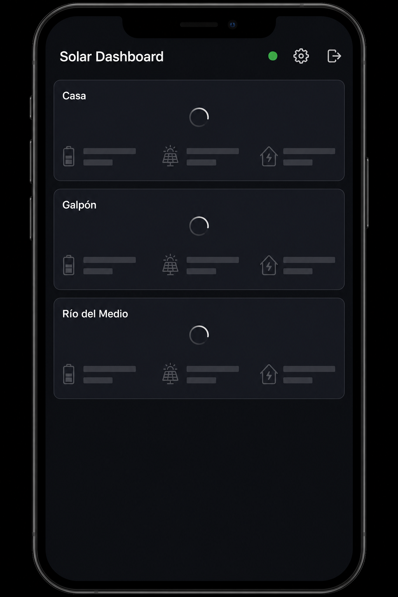
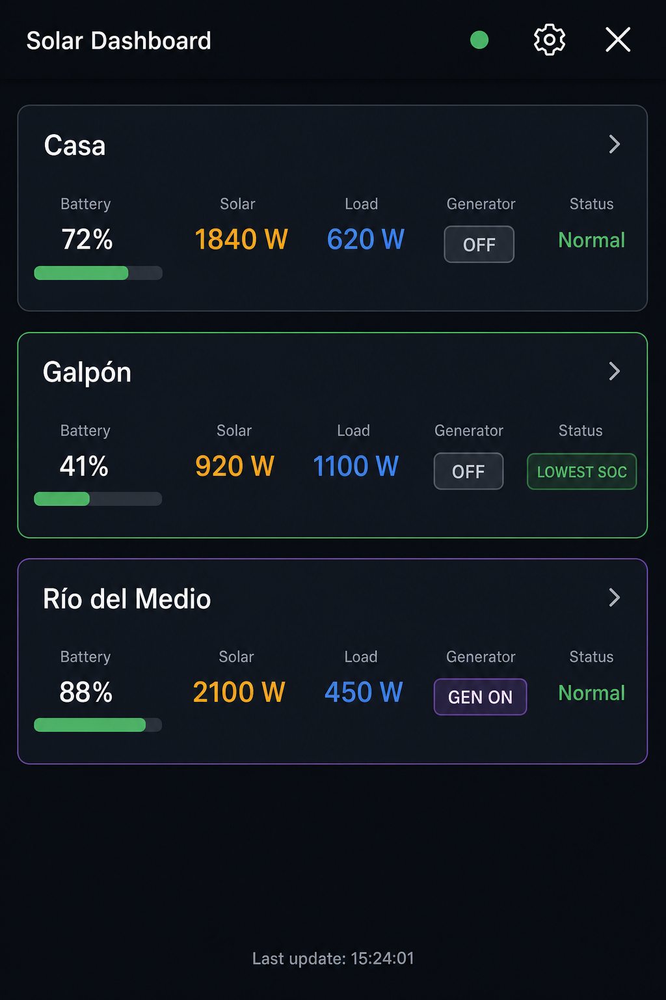
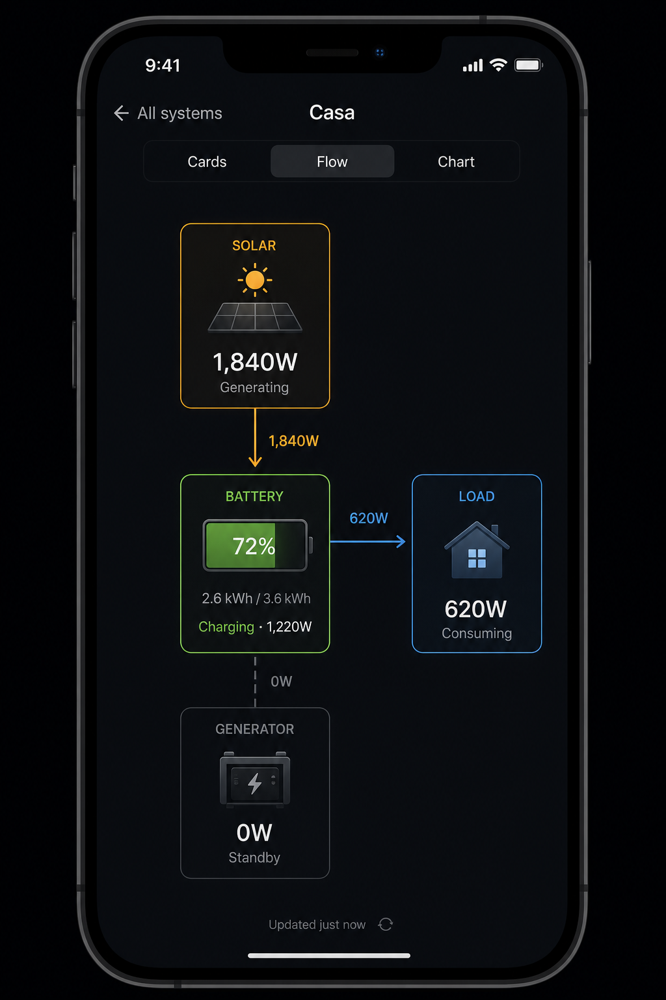

# Compare-as-landing — UX proposal

_Approved mocks: 2026-07-26. Spec only — no implementation yet. Use this doc to cut board tasks later._

## Goal

Make the **dashboard home** a multi-system summary grid (today’s Compare view), not Cards/Flow/Chart for a single active system.

- Home shows **only** compare-style summary tiles (one per configured system).
- Each tile has its **own loading spinner** and fills in when that system’s data arrives.
- After load, **tap a tile** → drill into that system’s detail (Cards / Flow / Chart), with a clear back path to the summary home.
- Header chrome stays: title + **status · settings · logout** (top-right).

## Approved mocks

| Mock | File | Shows |
|------|------|--------|
| Home — loading | [compare-landing-loading.png](./compare-landing-loading.png) | Summary tiles only; per-tile spinner; names visible; no view tabs; no system switcher |
| Home — loaded | [compare-landing-loaded.png](./compare-landing-loaded.png) | Filled tiles (battery bar, solar W, load W, gen/grid); lowest-SOC / gen-on highlights; last update; header icons status + settings + logout |
| Detail — flow | [compare-landing-detail-flow.png](./compare-landing-detail-flow.png) | After tap: back (“All systems”) + system name; Cards / Flow / Chart for **that** system only |

### Mock 1 — Home loading



### Mock 2 — Home loaded



### Mock 3 — Detail (Flow)



---

## Navigation model

```
┌─────────────────────────────────────┐
│  HOME (default landing)             │
│  Compare-style tile grid            │
│  Header: title + status/settings/✕  │
│  NO system-tabs                     │
│  NO Cards/Flow/Chart/Compare vtabs  │
└──────────────┬──────────────────────┘
               │ tap tile
               ▼
┌─────────────────────────────────────┐
│  DETAIL (one system)                │
│  Back → “All systems” (or equiv.)   │
│  System name as context             │
│  View tabs: Cards | Flow | Chart    │
│  Existing per-system content        │
│  (today’s production tile on Cards, │
│   flow diagram, chart, etc.)        │
└─────────────────────────────────────┘
```

### Default route

- After login / connect, land on **HOME** (summary tiles), not Cards for the previously selected system.
- Persist last detail view preference (Cards vs Flow vs Chart) for when the user opens a system — same idea as today’s `VIEW_KEY`, but scoped to **detail**, not home.
- Optional: remember last opened `systemId` only for restoring detail if we add deep-links later; not required for v1 of this change.

### Compare tab removal

- The standalone **Compare** view tab becomes redundant: home **is** compare.
- Hide/remove `#tab-compare` from the detail view toggle (and from home — home has no vtabs).
- Existing compare rendering (`renderComparison`, `/api/systems/all/data`, lowest-SOC / gen highlights) is the **home** implementation surface, not a fourth tab.

---

## Home — summary tiles

### Layout

- Reuse compare-card visual language (name, battery % + bar, solar W, load W, gen/grid on|off, status line).
- Keep existing highlight rules:
  - **Lowest SOC** badge / border among systems with valid data.
  - **Gen/grid on** badge / border when active.
- Grid: 1 column mobile; 2 columns from ~640px (same as current `.compare-grid`).
- Empty main chrome: no weather strip, no today’s production, no cards, no flow, no chart on home.

### Loading (per tile)

- On home enter / poll start: render one tile per system immediately (name known from systems list).
- Each tile shows a **spinner** (and/or skeleton metrics) until **that** system’s payload arrives.
- Prefer **independent** completion: if Casa loads before Galpón, Casa shows data while Galpón still spins.
- Error tile: keep compare error treatment (name + error message); no spinner stuck forever.
- Global status dot / last-update: update when any/all data settles (match current compare semantics where practical).

### Interaction

- Loaded (and optionally error) tiles are **tappable** / keyboard-activatable.
- Tap sets active system to that tile’s `systemId` and navigates to **DETAIL** (default detail subview: last used Cards/Flow/Chart, or Flow if we want to match mock 3 — decide in implementation task; mock shows Flow selected).
- Visual affordance: cursor/pointer, optional pressed state; avoid looking like inert static cards.

### Single-system accounts

- Still show home as one summary tile (not skip straight to detail), so UX is consistent.
- Tap still opens detail for that system.
- Today compare tab is hidden when `systems.length < 2`; **that gate goes away** for home — home always uses the tile grid when ≥1 system.

### Zero systems

- Keep existing empty / “add a system” manage flow; no fake tiles.

---

## Detail — one system

### Chrome

- **Back** control → return to HOME (summary). Copy: e.g. “All systems” / i18n key (EN + ES).
- System name visible (header subtitle or back-row title as in mock).
- Header right icons unchanged: status, settings, logout.
- **View tabs**: Cards | Flow | Chart only (no Compare).
- System tabs (`#system-tabs`) on detail: **optional**. Preferred: omit switcher on detail and switch systems only via home tiles (cleaner, matches mocks). If we keep tabs, document as follow-up — default proposal is **no system-tabs on detail**.

### Content

- Unchanged per-system surfaces:
  - **Cards** — including today’s production tile, battery/solar/load/gen cards, etc.
  - **Flow** — energy flow diagram.
  - **Chart** — intraday / multi-day as today.
- Polling continues for the active system while on detail; home poll uses all-systems endpoint when on home.

---

## Data / API

- Home: implemented as one independent `GET /api/systems/:id/data` fetch per system (not the aggregate `/api/systems/all/data`), so a slow system's tile never blocks the others from settling — chosen over the single-round-trip option because that endpoint only resolves once every system has settled, which defeats independent per-tile loading (SOLAR-0165).
- Detail: existing single-system poll path.
- No new Worker endpoints required for the UX change.
- No KV archive changes.

---

## i18n

New/adjusted strings (EN + ES at minimum):

- Back label (“All systems” / equivalent).
- Any home-specific empty/error copy if distinct from compare.
- Remove or stop exposing Compare tab label if tab is gone.
- Accessibility: tile button labels (“Open {system name}”), loading (“Loading {system name}”).

---

## Persistence / localStorage

| Key / concern | Proposed behavior |
|---------------|-------------------|
| Current `VIEW_KEY` (cards/flow/chart/compare) | Stop treating `compare` as a top-level view. Home is implicit. Persist detail subview as `cards` \| `flow` \| `chart` only. |
| Active `systemId` | Set on tile tap; used while in detail. |
| Migrating old `compare` saved view | On load, map `compare` → home (summary), not detail. |

---

## Tests (when implementing)

- Playwright: after login with ≥2 systems, landing shows summary tiles (not Cards).
- Per-tile loading → data (mock Worker can delay one system).
- Tap tile → detail with that system’s name / data; back returns to home.
- Single-system account still gets one tile then detail.
- Compare tab absent from detail vtabs.
- Regression: Cards today’s production, Flow, Chart still work inside detail.
- Update helpers that currently navigate via `#tab-compare` / `waitForCompareData`.

---

## Suggested task breakdown (for board later)

Use as checklist when creating SOLAR-* tasks; not filed yet.

1. **Docs already done** — mocks + this spec in `docs/mocks/`.
2. **Navigation shell** — introduce home vs detail app states; default to home; back control; hide system-tabs and vtabs on home; hide Compare tab.
3. **Home tiles** — promote compare grid to home; per-tile spinner; independent fill; tap → set system + open detail.
4. **Detail wiring** — Cards/Flow/Chart only for active system; restore last detail subview; migrate `VIEW_KEY`.
5. **i18n** — back label, a11y strings, drop unused compare-tab copy if dead.
6. **E2E** — landing, loading, tap-through, back, single-system; retire/replace compare-tab tests.
7. **Polish** — focus states, pull-to-refresh on home refreshes all tiles, last-update line.

---

## Out of scope (this proposal)

- Redesigning tile metrics beyond current compare card fields.
- New adapters or Worker history storage.
- Changing alert / manage / auth flows.
- Adding Chart or today’s production onto the home grid (detail only).

## Open decisions (resolve in first implementation task)

1. Default detail subview on first tile tap: **Flow** (matches mock 3) vs last-used vs **Cards**.
2. Keep or remove `#system-tabs` on detail (proposal: remove).
3. Spinner-only vs spinner + skeleton bars (mocks show spinner; current compare uses skeleton — either is fine if per-tile and clear).
